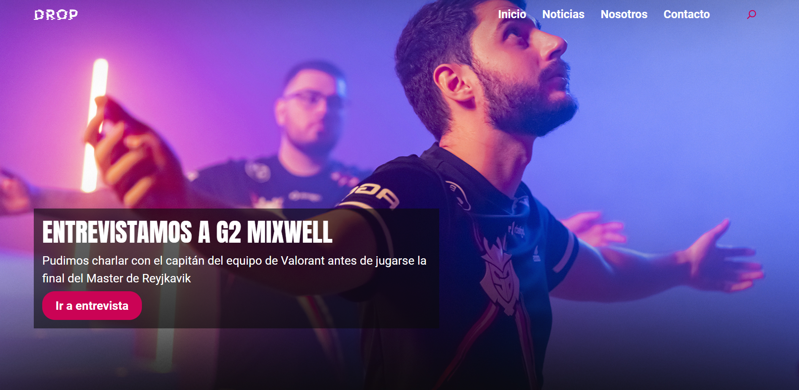
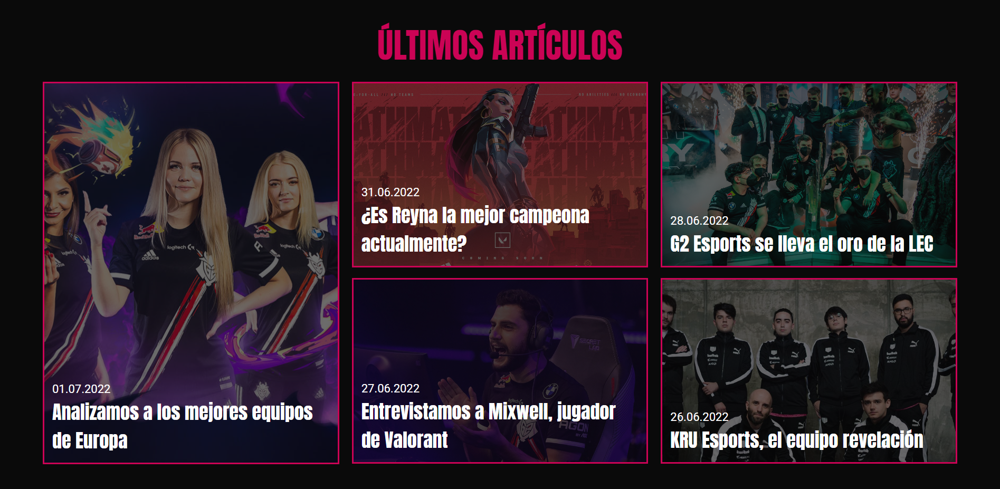
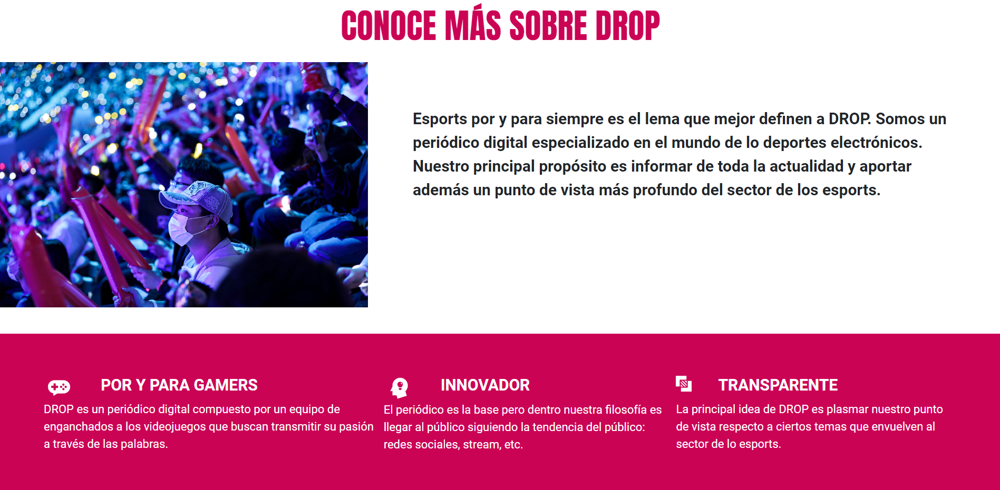
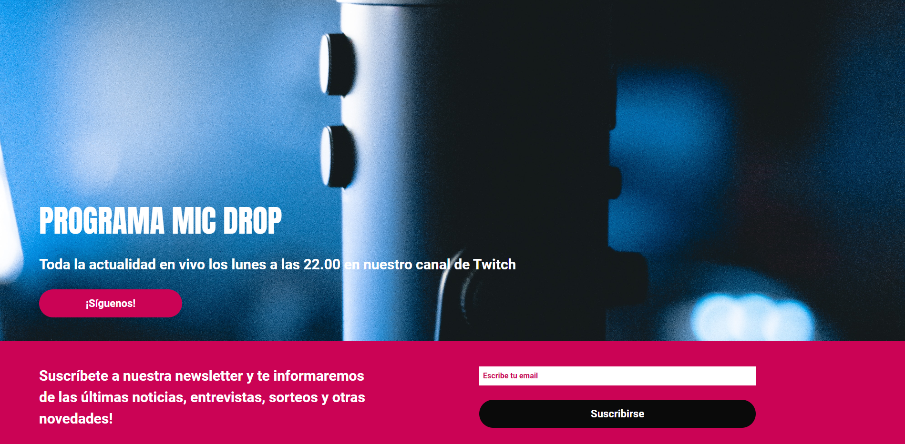

# Drop

This is the final project that I had to do to finish the Web Development Master in [Gauss Multimedia](https://www.gaussmultimedia.com/). Drop had to be a online magazine and we could choose the topic of this project so I decided to create a blog related to esports. 

## Table of Contents

* [Requirements](#general-information)
* [Technologies Used](#technologies-used)
* [Features](#features)
* [Screenshots](#screenshots)
* [Contact](#contact)

## Requirements

To pass this project there were some requirements that must been done:
- Mandatory sections: Home, Category (in my case "Valorant"), Post, Contact.
- Must be responsive.
- Can be a Wordpress custom theme or full code.

## Technologies Used

- HTML5 - CSS - Boostrap - Javascript 

## Features

- Fully responsive

## Example

- [Click here](https://kervinmarquinez.github.io/dropmagazine/) to see the live example.

## Screenshots

 
 

 
 

 
 

## Contact

Created by [Adrian Kervin](https://www.linkedin.com/in/kervinmarquinez/) - feel free to contact!